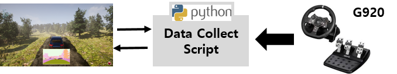
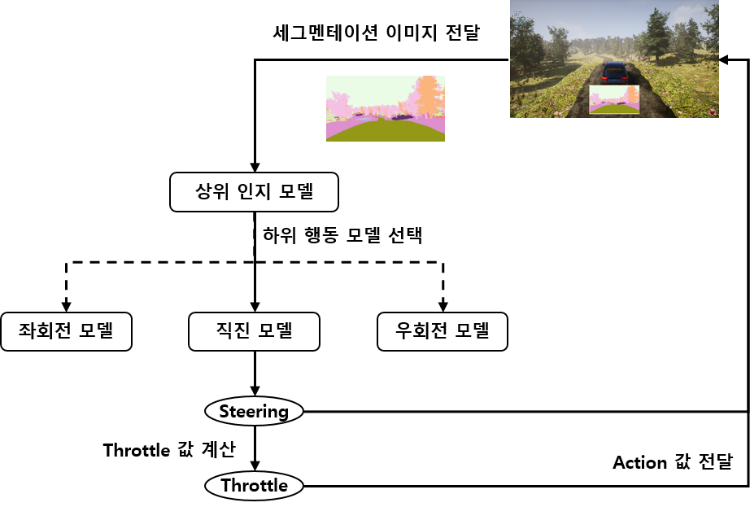
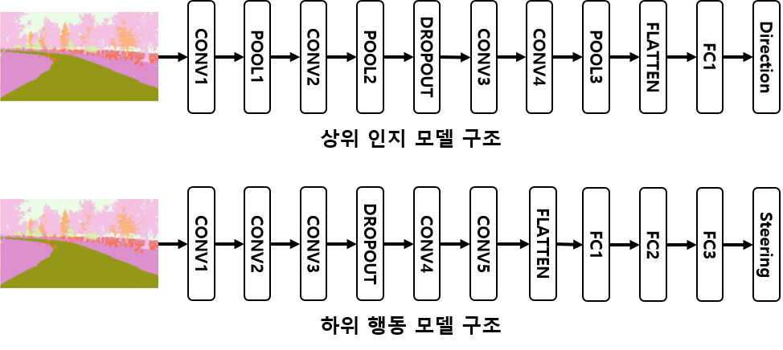
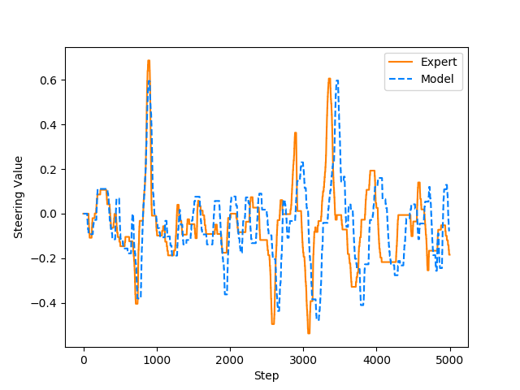

## AutonomousDriving
계층적 모방학습을 이용한 시뮬레이션 기반 험지 환경에서의 자율주행 자동차 학습 (KSC 2019) <a href="https://cilab.gist.ac.kr/hp/wp-content/uploads/publications/domestic_conference/2019/ksc_dhpark.pdf">[PDF]</a>

#### 험지 환경 제작 및 데이터 수집
- Python, Keras

#### 험지 환경 제작 및 데이터 수집
- 언리얼 엔진 기반의 AirSim 시뮬레이터에서 제공하지 않는 험지 환경의 맵을 제작 후 주행 데이터 수집
- 언리얼 엔진의 Landscape, foliage 툴을 사용하여 험지 환경 제작

#### 모델 구현 및 학습
- 상위 인지 모델에서 이미지를 직진, 좌회전, 우회전 구간으로 분류하며, 이를 위해 수집한 데이터에 labeling 수행
- 하위 행동 모델에서 차량 제어에 필요한 Steering, Throttle 값을 추론하며, Convolution 네트워크와 Fully Connected Layer로 모델을 구성

#### 결과 분석
- 수집한 데이터 중에서 학습에서 사용하지 않은 데이터와 Steering, Throttle 값을 비교
- 사람이 주행한 주행 정책과 모델이 추론한 주행 정책이 거의 일치
- <a href="https://youtu.be/RNCdDFeXFdc">시연 영상</a>

